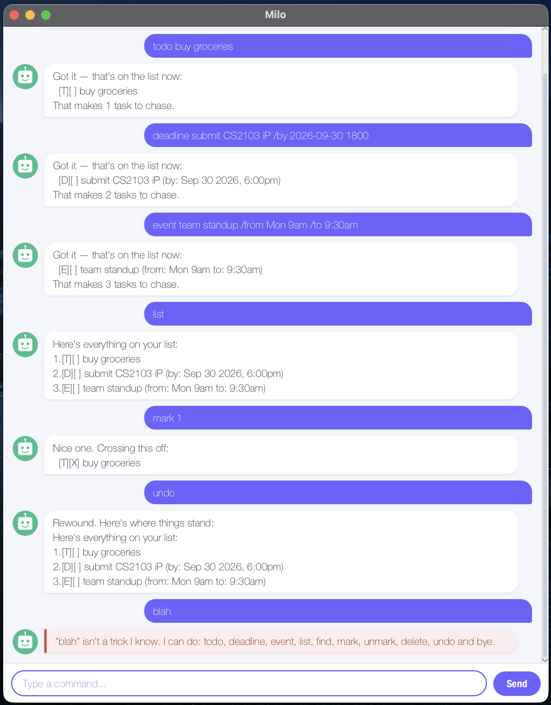

# Milo User Guide



Milo is a desktop chatbot for keeping track of the things you have to do.
You talk to it by typing, and it talks back — so if you type quickly, Milo
gets things onto your list faster than a normal to-do app can.

Milo tracks three kinds of task: plain **todos**, **deadlines** that are due by
a certain date, and **events** that run between a start and an end. Your list
is saved automatically after every change, so it's still there the next time
you open Milo.

## Adding todos

Adds a task with no date attached — something you need to do, but not by any
particular time.

Example: `todo buy groceries`

Milo confirms the task and tells you how many you now have:

```
Got it — that's on the list now:
  [T][ ] buy groceries
That makes 1 task to chase.
```

## Adding deadlines

Adds a task that is due by a particular date, written after `/by`.

Milo understands dates written as `2026-09-30` or `30/9/2026`, and you can add
a time in 24-hour form: `2026-09-30 1800`. Whichever way you type it, Milo
shows it back in a readable form.

Example: `deadline submit CS2103 iP /by 2026-09-30 1800`

```
Got it — that's on the list now:
  [D][ ] submit CS2103 iP (by: Sep 30 2026, 6:00pm)
That makes 2 tasks to chase.
```

Leave the time off if you only care about the day:

Example: `deadline return library book /by 2026-10-15`

```
Got it — that's on the list now:
  [D][ ] return library book (by: Oct 15 2026)
That makes 3 tasks to chase.
```

## Adding events

Adds a task that runs from one time to another, written after `/from` and
`/to`. These can be real dates or plain words — `Mon 9am` is perfectly fine.

Example: `event team standup /from Mon 9am /to 9:30am`

```
Got it — that's on the list now:
  [E][ ] team standup (from: Mon 9am to: 9:30am)
That makes 4 tasks to chase.
```

## Listing your tasks

Shows everything on your list, numbered. Those numbers are what you use with
`mark`, `unmark` and `delete`.

Example: `list`

```
Here's everything on your list:
1.[T][ ] buy groceries
2.[D][ ] submit CS2103 iP (by: Sep 30 2026, 6:00pm)
3.[D][ ] return library book (by: Oct 15 2026)
4.[E][ ] team standup (from: Mon 9am to: 9:30am)
```

## Marking a task as done

Puts an `X` in a task's box. Use the number shown by `list`.

Example: `mark 1`

```
Nice one. Crossing this off:
  [T][X] buy groceries
```

Changed your mind? `unmark` puts it back:

Example: `unmark 1`

```
Sure — back on the pile:
  [T][ ] buy groceries
```

## Finding tasks

Shows only the tasks whose description contains what you searched for. Useful
once the list is long enough that reading all of it is a chore.

The search is case-sensitive, so `book` finds "return library book" but `Book`
does not.

Example: `find book`

```
Here's what I sniffed out:
1.[D][ ] return library book (by: Oct 15 2026)
```

If nothing matches, Milo says so rather than showing an empty list.

## Deleting a task

Removes a task for good. The tasks after it move up, so the numbers stay
in order.

Example: `delete 1`

```
Buried it. This one's gone:
  [T][ ] buy groceries
1 task left.
```

## Undoing the last change

Puts your list back the way it was before the last command that changed it —
handy when you delete the wrong number.

Milo remembers one step only, so `undo` twice will not take you back two
changes.

Example: `undo`

```
Rewound. Here's where things stand:
Here's everything on your list:
1.[T][ ] buy groceries
2.[D][ ] return book (by: Oct 15 2026)
```

## Exiting

Closes Milo. Your list is already saved, so nothing is lost.

Example: `bye`

```
Off I go. Your list is safe with me!
```

## Saving your data

Milo saves after every change, to `data/milo.txt` next to wherever you run it.
There is no save command, and nothing to remember to do.

When Milo starts, it tells you what it found:

```
Fetched 4 tasks from last time. Say list to see them.
```

If that file has been edited by hand into something Milo cannot read, it keeps
every line it does understand, tells you how many it skipped, and carries on
with the rest of your list intact.

## When something goes wrong

Milo tries to say what it would rather you had typed, instead of just refusing.
A few things it will stop you doing:

- **A command it doesn't know** — it lists the ones it does.
- **A task number that isn't on the list** — it tells you the range that is.
- **A task you already have** — duplicates are refused, so the list stays honest.
- **A `|` in a task's text** — Milo stores your tasks in a file that uses `|`
  between fields, so it asks you to write it without one rather than losing the
  task later.
- **An event that ends before it starts** — checked whenever both ends are
  dates Milo can read.
- **A date that doesn't exist**, such as `30/2/2026` — rejected rather than
  quietly shifted to the end of the month.

These replies appear in their own colour in the chat window, so a mistyped
command is easy to spot as you scroll back.

## Command summary

| Command  | What it does                    | Example                                        |
|----------|---------------------------------|------------------------------------------------|
| `todo`   | Adds a task with no date        | `todo buy groceries`                           |
| `deadline` | Adds a task due by a date     | `deadline submit iP /by 2026-09-30 1800`       |
| `event`  | Adds a task with a start and end | `event standup /from Mon 9am /to 9:30am`      |
| `list`   | Shows everything on your list   | `list`                                         |
| `mark`   | Marks a task done               | `mark 1`                                       |
| `unmark` | Marks a task not done           | `unmark 1`                                     |
| `find`   | Shows tasks matching a keyword  | `find book`                                    |
| `delete` | Removes a task                  | `delete 1`                                     |
| `undo`   | Reverses the last change        | `undo`                                         |
| `bye`    | Closes Milo                     | `bye`                                          |
